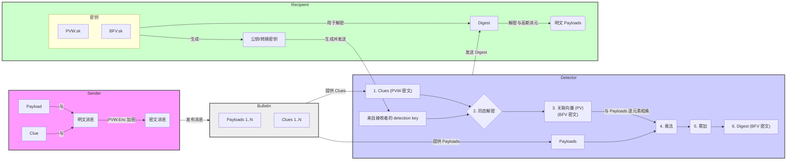

# 系统架构 Mermaid 图

这是一个根据项目架构图和代码分析得出的系统流程图。

## 流程解读

1.  **Sender (发送者)**: 将 `Payload`（载荷）和 `Clue`（线索）打包成一条明文消息，并使用 `PVW` 公钥进行加密，形成密文消息。
2.  **Bulletin (公告板)**: 这是一个概念上的组件，存储了所有由发送者发布的 `Payloads` 和加密后的 `Clues`。
3.  **Detector (探测器)**:
    *   从 `Bulletin` 获取所有的 `Clues` 和 `Payloads`。
    *   使用从 `Recipient` 处获得的 `detection key`（检测密钥），对 `Clues` 进行同态解密，得到一个加密状态下的“关联向量” (`Pertinency Vector`)。这个向量指明了哪些消息是目标消息。
    *   将这个加密的关联向量与 `Payloads` 进行同态乘法，然后将结果累加起来，生成一个最终的 `Digest`（摘要）密文。
4.  **Recipient (接收者)**:
    *   首先，`Recipient` 生成系统所需的所有密钥（公钥和私钥）。它将用于 `Detector` 的 `detection key` 发送给 `Detector`。
    *   接收到 `Detector` 计算出的 `Digest` 后，使用自己的私钥对其进行解密，并通过高斯消元等数学方法，最终恢复出自己感兴趣的明文 `Payloads`。

这个流程实现了“不经意消息检索”（OMR）的核心思想：`Detector` 在不知道哪些消息被检索、也不知道消息内容的情况下，帮助 `Recipient`完成了数据筛选和提取。
