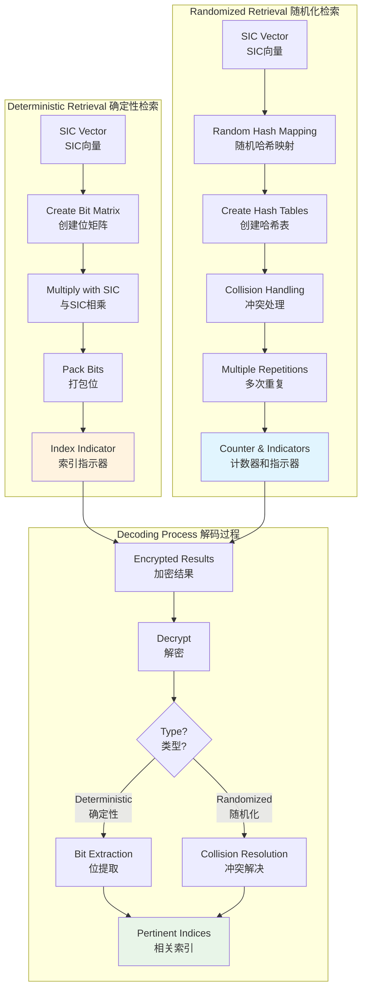
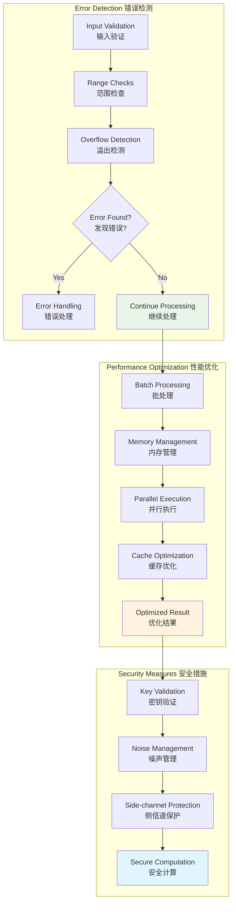

# Cryptographic Protocol Details

This document provides detailed Mermaid diagrams explaining the cryptographic protocols used in the OMR system.

## 1. PVW to BFV Conversion Process

```mermaid
flowchart TD
    subgraph "PVW Encryption PVW加密"
        direction TB
        P1[Message m<br/>消息m] --> P2[PVW.Enc(m)<br/>PVW加密]
        P2 --> P3[PVW Ciphertext<br/>PVW密文<br/>(a, b)]
        P3 --> P4[a ∈ Z_q^n<br/>b ∈ Z_q^ℓ]
    end
    
    subgraph "Switching Key Generation 切换密钥生成"
        direction TB
        S1[PVW Secret Key<br/>PVW私钥 s] --> S2[BFV Public Key<br/>BFV公钥 pk]
        S2 --> S3[Generate Switching Key<br/>生成切换密钥]
        S3 --> S4[SK = BFV.Enc(s_i)<br/>切换密钥]
    end
    
    subgraph "Homomorphic Conversion 同态转换"
        direction TB
        H1[PVW Ciphertext<br/>PVW密文] --> H2[Apply Switching Key<br/>应用切换密钥]
        H2 --> H3[Compute B + AS<br/>计算B + AS]
        H3 --> H4[BFV Ciphertext<br/>BFV密文]
        H4 --> H5[Range Check<br/>范围检查]
        H5 --> H6[Final BFV Result<br/>最终BFV结果]
    end
    
    P4 --> H1
    S4 --> H2
    
    style P3 fill:#ffecb3
    style S4 fill:#e1f5fe
    style H6 fill:#e8f5e8
```

## 2. Homomorphic Operations Flow

```mermaid
graph TD
    subgraph "Multiplication Tree 乘法树"
        direction TB
        M1[Input Ciphertexts<br/>输入密文] --> M2[Pairwise Multiply<br/>成对相乘]
        M2 --> M3[Relinearization<br/>重线性化]
        M3 --> M4[Modulus Switching<br/>模数切换]
        M4 --> M5{More Pairs?<br/>还有更多对?}
        M5 -->|Yes| M2
        M5 -->|No| M6[Single Result<br/>单个结果]
    end
    
    subgraph "Rotation and Sum 旋转求和"
        direction TB
        R1[Input Ciphertext<br/>输入密文] --> R2[Rotate by 2^i<br/>按2^i旋转]
        R2 --> R3[Add Rotated<br/>加上旋转结果]
        R3 --> R4{i < log(n)?<br/>i < log(n)?}
        R4 -->|Yes| R5[i = i * 2]
        R5 --> R2
        R4 -->|No| R6[Sum Result<br/>求和结果]
    end
    
    subgraph "Packing Operations 打包操作"
        direction TB
        P1[Multiple Ciphertexts<br/>多个密文] --> P2[Apply Weights<br/>应用权重]
        P2 --> P3[Bipartite Mapping<br/>二分图映射]
        P3 --> P4[Accumulate<br/>累加]
        P4 --> P5[Packed Result<br/>打包结果]
    end
    
    M6 --> R1
    R6 --> P1
    
    style M6 fill:#fff3e0
    style R6 fill:#e3f2fd
    style P5 fill:#e8f5e8
```

## 3. Index Retrieval Mechanisms



## 4. Mathematical Operations in Detail

```mermaid
graph LR
    subgraph "Modular Arithmetic 模运算"
        direction TB
        MA1[Input a, b<br/>输入a, b] --> MA2[Compute a * b<br/>计算a * b]
        MA2 --> MA3[Modulo q<br/>模q]
        MA3 --> MA4[Result mod q<br/>结果模q]
    end

    subgraph "Gaussian Elimination 高斯消元"
        direction TB
        GE1[Matrix A, Vector b<br/>矩阵A, 向量b] --> GE2[Find Pivot<br/>寻找主元]
        GE2 --> GE3[Eliminate Column<br/>消除列]
        GE3 --> GE4[Update Matrix<br/>更新矩阵]
        GE4 --> GE5{More Columns?<br/>还有更多列?}
        GE5 -->|Yes| GE2
        GE5 -->|No| GE6[Back Substitution<br/>回代求解]
        GE6 --> GE7[Solution Vector<br/>解向量]
    end

    subgraph "Polynomial Operations 多项式运算"
        direction TB
        PO1[Polynomial f(x)<br/>多项式f(x)] --> PO2[NTT Transform<br/>NTT变换]
        PO2 --> PO3[Point-wise Multiply<br/>逐点相乘]
        PO3 --> PO4[Inverse NTT<br/>逆NTT]
        PO4 --> PO5[Result Polynomial<br/>结果多项式]
    end

    style MA4 fill:#fff3e0
    style GE7 fill:#e8f5e8
    style PO5 fill:#e1f5fe
```

## 5. Error Handling and Optimization


