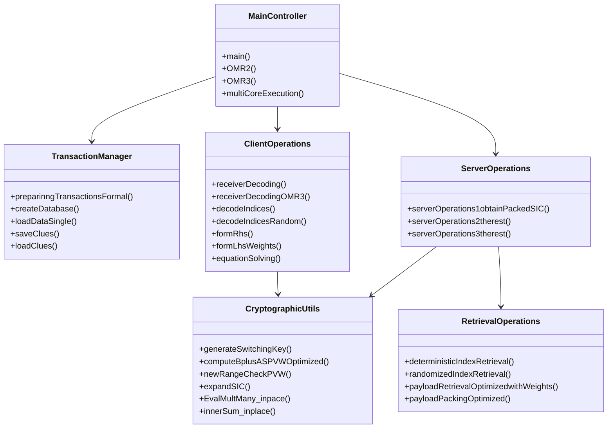
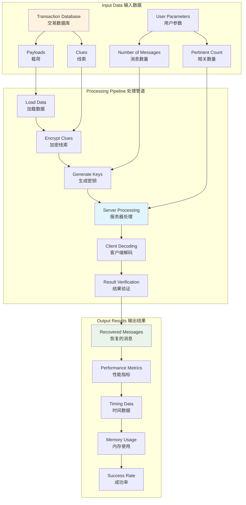
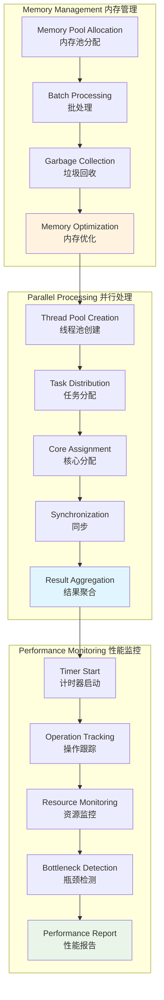
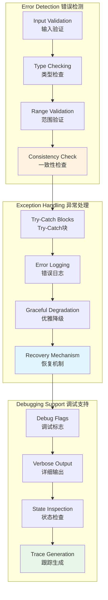
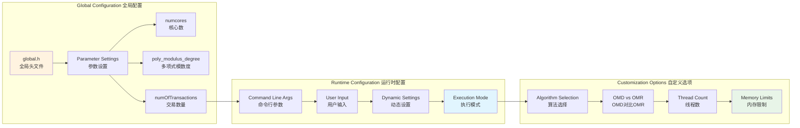

# Implementation Flow and Code Structure

This document provides detailed Mermaid diagrams explaining the implementation flow and code structure of the OMR system.

## 1. Main Function Flow

```mermaid
flowchart TD
    subgraph "Program Entry 程序入口"
        direction TB
        M1[main() Function<br/>主函数] --> M2[User Menu<br/>用户菜单]
        M2 --> M3{Select Option<br/>选择选项}
        M3 -->|OMD1p| M4[OMD Single Thread<br/>OMD单线程]
        M3 -->|OMR2p| M5[OMR2 Single Thread<br/>OMR2单线程]
        M3 -->|OMR3p| M6[OMR3 Single Thread<br/>OMR3单线程]
        M3 -->|Multi-core| M7[Multi-core Execution<br/>多核执行]
    end
    
    subgraph "Setup Phase 设置阶段"
        direction TB
        S1[Initialize Parameters<br/>初始化参数] --> S2[Generate PVW Keys<br/>生成PVW密钥]
        S2 --> S3[Generate BFV Keys<br/>生成BFV密钥]
        S3 --> S4[Create Switching Keys<br/>创建切换密钥]
        S4 --> S5[Setup Complete<br/>设置完成]
    end
    
    subgraph "Execution Flow 执行流程"
        direction TB
        E1[Prepare Transactions<br/>准备交易] --> E2[Server Phase 1<br/>服务器阶段1]
        E2 --> E3[Server Phase 2<br/>服务器阶段2]
        E3 --> E4[Client Decoding<br/>客户端解码]
        E4 --> E5[Verify Results<br/>验证结果]
    end
    
    M4 --> S1
    M5 --> S1
    M6 --> S1
    M7 --> S1
    S5 --> E1
    
    style M1 fill:#e3f2fd
    style S5 fill:#fff3e0
    style E5 fill:#e8f5e8
```

## 2. Class and Function Hierarchy



## 3. Data Flow Between Components



## 4. Memory and Performance Management



## 5. Error Handling and Debugging



## 6. Configuration and Customization


