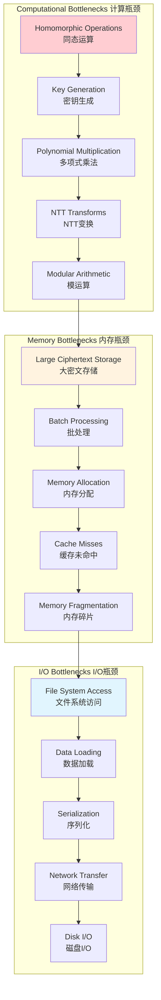
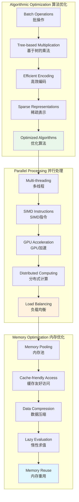
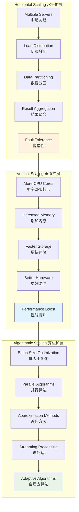
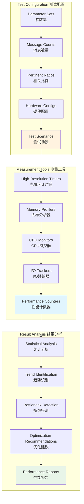

# Performance Analysis and Optimization

This document provides Mermaid diagrams for performance analysis and optimization strategies in the OMR system.

## 1. Performance Bottlenecks Analysis

## 2. Optimization Strategies

## 3. Performance Metrics and Monitoring

```mermaid
graph LR
    subgraph "Timing Metrics 时间指标"
        direction TB
        TM1[Setup Time<br/>设置时间] --> TM2[Key Generation Time<br/>密钥生成时间]
        TM2 --> TM3[Encryption Time<br/>加密时间]
        TM3 --> TM4[Server Processing Time<br/>服务器处理时间]
        TM4 --> TM5[Decryption Time<br/>解密时间]
        TM5 --> TM6[Total Execution Time<br/>总执行时间]
    end
    
    subgraph "Memory Metrics 内存指标"
        direction TB
        MM1[Peak Memory Usage<br/>峰值内存使用] --> MM2[Average Memory Usage<br/>平均内存使用]
        MM2 --> MM3[Memory Allocation Count<br/>内存分配次数]
        MM3 --> MM4[Cache Hit Rate<br/>缓存命中率]
        MM4 --> MM5[Memory Efficiency<br/>内存效率]
    end
    
    subgraph "Throughput Metrics 吞吐量指标"
        direction TB
        TPM1[Messages per Second<br/>每秒消息数] --> TPM2[Operations per Second<br/>每秒操作数]
        TPM2 --> TPM3[Bandwidth Utilization<br/>带宽利用率]
        TPM3 --> TPM4[CPU Utilization<br/>CPU利用率]
        TPM4 --> TPM5[System Efficiency<br/>系统效率]
    end
    
    TM6 --> MM1
    MM5 --> TPM1
    
    style TM6 fill:#fff3e0
    style MM5 fill:#e1f5fe
    style TPM5 fill:#e8f5e8
```

## 4. Scalability Analysis

## 5. Benchmarking Framework

## 6. Real-world Performance Considerations

```mermaid
flowchart LR
    subgraph "Network Latency 网络延迟"
        direction TB
        NL1[Client-Server Distance<br/>客户端-服务器距离] --> NL2[Bandwidth Limitations<br/>带宽限制]
        NL2 --> NL3[Protocol Overhead<br/>协议开销]
        NL3 --> NL4[Congestion Control<br/>拥塞控制]
    end

    subgraph "Security Overhead 安全开销"
        direction TB
        SO1[Encryption Cost<br/>加密成本] --> SO2[Key Management<br/>密钥管理]
        SO2 --> SO3[Authentication<br/>身份验证]
        SO3 --> SO4[Secure Channels<br/>安全通道]
    end

    subgraph "Deployment Factors 部署因素"
        direction TB
        DF1[Hardware Diversity<br/>硬件多样性] --> DF2[Operating Systems<br/>操作系统]
        DF2 --> DF3[Library Dependencies<br/>库依赖]
        DF3 --> DF4[Configuration Management<br/>配置管理]
    end

    NL4 --> SO1
    SO4 --> DF1

    style NL4 fill:#fff3e0
    style SO4 fill:#e1f5fe
    style DF4 fill:#e8f5e8
```

