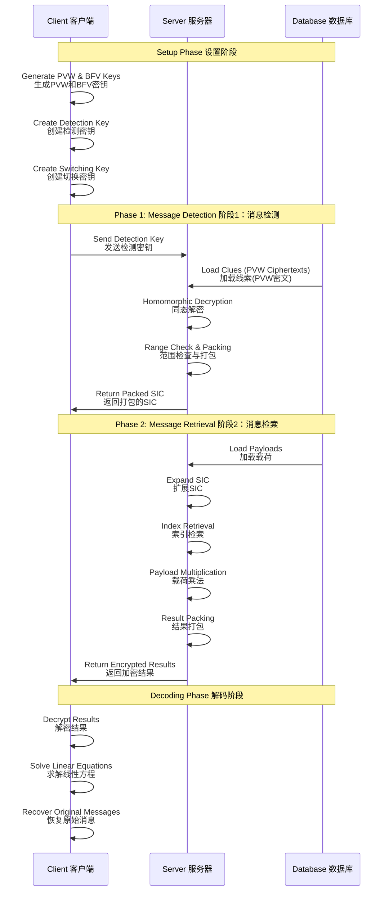
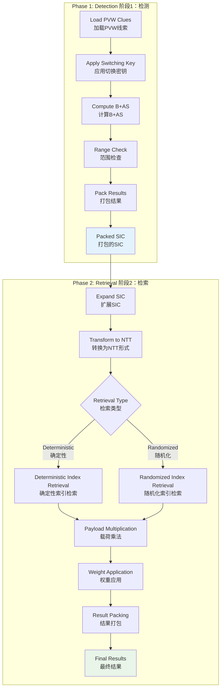
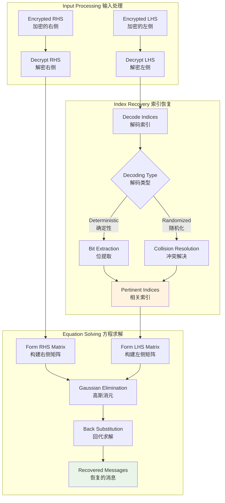

# Oblivious Message Retrieval (OMR) System Overview

This document provides comprehensive Mermaid diagrams explaining the ObliviousMessageRetrieval project architecture, data flow, and cryptographic protocols.

## 1. High-Level System Architecture

```mermaid
graph TB
    subgraph "Client/Recipient 客户端/接收者"
        direction TB
        CK[Key Generation<br/>密钥生成]
        CQ[Query Preparation<br/>查询准备]
        CD[Decoding & Recovery<br/>解码与恢复]
        CK --> CQ
        CQ --> CD
    end
    
    subgraph "Server/Detector 服务器/探测器"
        direction TB
        SP1[Phase 1: Detection<br/>阶段1：检测]
        SP2[Phase 2: Retrieval<br/>阶段2：检索]
        SP1 --> SP2
    end
    
    subgraph "Data Storage 数据存储"
        direction TB
        BB[Bulletin Board<br/>公告板]
        PL[Payloads<br/>载荷数据]
        CL[Clues<br/>线索数据]
        BB --> PL
        BB --> CL
    end
    
    CK -.->|Detection Key<br/>检测密钥| SP1
    CQ -.->|Switching Key<br/>切换密钥| SP1
    CL -.->|Encrypted Clues<br/>加密线索| SP1
    SP1 -.->|Packed SIC<br/>打包SIC| SP2
    PL -.->|Message Payloads<br/>消息载荷| SP2
    SP2 -.->|Encrypted Results<br/>加密结果| CD
    
    style Client fill:#e1f5fe
    style Server fill:#f3e5f5
    style "Data Storage" fill:#e8f5e8
```

## 2. Cryptographic Protocol Flow



## 3. Data Structure and Encoding

```mermaid
graph LR
    subgraph "Message Structure 消息结构"
        direction TB
        M[Message 消息]
        M --> P[Payload 载荷]
        M --> C[Clue 线索]
        P --> PD[Payload Data<br/>载荷数据<br/>306 elements]
        C --> CA[Clue.a<br/>PVW密文a部分]
        C --> CB[Clue.b<br/>PVW密文b部分]
    end
    
    subgraph "Encoding Process 编码过程"
        direction TB
        PT[Plaintext Message<br/>明文消息]
        PT --> PVW[PVW Encryption<br/>PVW加密]
        PVW --> CT[Ciphertext Clue<br/>密文线索]
        
        PT --> BFV[BFV Encoding<br/>BFV编码]
        BFV --> PP[Packed Payload<br/>打包载荷]
    end
    
    subgraph "Storage Format 存储格式"
        direction TB
        FS[File System<br/>文件系统]
        FS --> PF[Payload Files<br/>载荷文件<br/>../data/payloads/]
        FS --> CF[Clue Files<br/>线索文件<br/>../data/clues/]
    end
    
    M -.-> PT
    CT -.-> CF
    PP -.-> PF
    
    style "Message Structure" fill:#fff2cc
    style "Encoding Process" fill:#d5e8d4
    style "Storage Format" fill:#f8cecc
```

## 4. Server Operations Detailed Flow



## 5. Client Decoding Process


